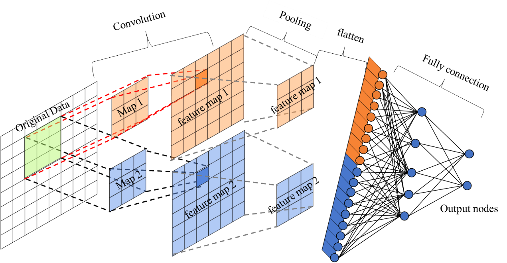
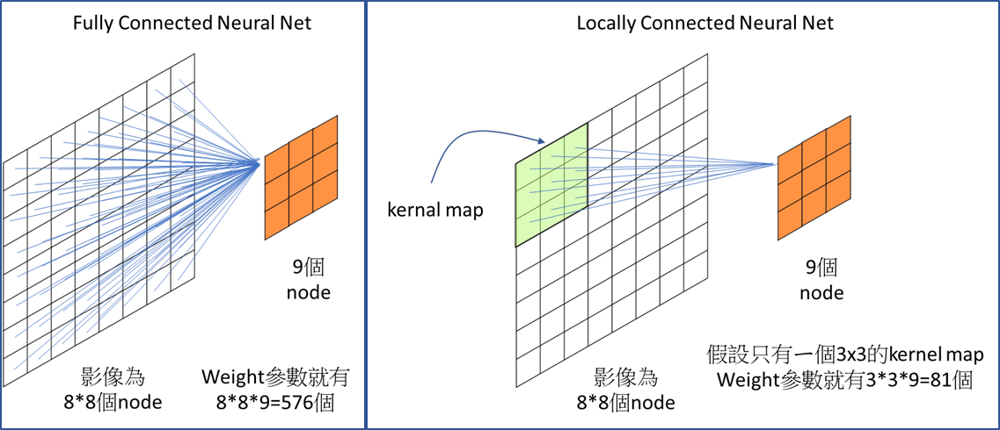

# 卷積神經網路(Convolutional neural network, CNN) 

卷積神經網路實線的重點之一就是Shared Weight*(權重共享)這件事情，下左圖，透過卷積運算的方法達到Local connected(局部連結) neural nets。

圖片來源：https://chih-sheng-huang821.medium.com/%E5%8D%B7%E7%A9%8D%E7%A5%9E%E7%B6%93%E7%B6%B2%E8%B7%AF-convolutional-neural-network-cnn-cnn%E9%81%8B%E7%AE%97%E6%B5%81%E7%A8%8B-ecaec240a631

## Convolution(卷積)

    透過卷積核(Kernels)滑動對圖像做訊息提取，並藉由步長(Strides)與填充 (Padding)控制圖像的長寬

### Filter(卷積核)
橘色的矩陣代表"卷積核(Kernel or Filter)"，利用 Filter 在輸入圖片上滑動並且持續進行矩陣內積，卷積後得到的圖片我們稱之為 Feature map。Filter有多少個Feature map就有多少個，常見的有16、32、64。Filter是被Train出來的。

### Receptive field(感知區塊)
Filter的尺度

### Stride(步伐)
Filter移動的步數

### Padding(填充)
補值，常見的是Zero Padding(周圍捕0)

### Shared weights(權重共享)
Filter裡面的數值就是權重，這張圖每個位置都是由同個Filter掃的，所以權重是一樣的。

圖片來源：https://medium.com/%E9%9B%9E%E9%9B%9E%E8%88%87%E5%85%94%E5%85%94%E7%9A%84%E5%B7%A5%E7%A8%8B%E4%B8%96%E7%95%8C/%E6%A9%9F%E5%99%A8%E5%AD%B8%E7%BF%92-ml-note-convolution-neural-network-%E5%8D%B7%E7%A9%8D%E7%A5%9E%E7%B6%93%E7%B6%B2%E8%B7%AF-bfa8566744e9

圖片來源：https://medium.com/%E9%9B%9E%E9%9B%9E%E8%88%87%E5%85%94%E5%85%94%E7%9A%84%E5%B7%A5%E7%A8%8B%E4%B8%96%E7%95%8C/%E6%A9%9F%E5%99%A8%E5%AD%B8%E7%BF%92-ml-note-convolution-neural-network-%E5%8D%B7%E7%A9%8D%E7%A5%9E%E7%B6%93%E7%B6%B2%E8%B7%AF-bfa8566744e9

圖片來源：https://chih-sheng-huang821.medium.com/%E5%8D%B7%E7%A9%8D%E7%A5%9E%E7%B6%93%E7%B6%B2%E8%B7%AF-convolutional-neural-network-cnn-cnn%E9%81%8B%E7%AE%97%E6%B5%81%E7%A8%8B-ecaec240a631

## Pooling(池化)

    圖片的縮放不會影響辨識，Feature map降維，並且保留重要的特徵，參數減少，可防止Overfitting。

圖片來源：https://hackmd.io/@allen108108/rkn-oVGA4